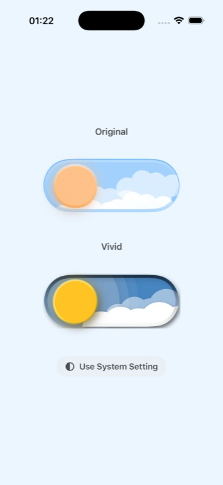
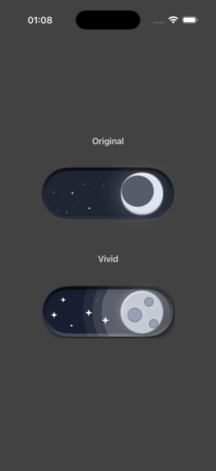

# Dark Mode Switch Button

An iOS 17+ SwiftUI demo that recreates Kristine Kolodziejski's animated Power Apps light/dark toggle as a dedicated app appearance control.

| Light | Dark |
| --- | --- |
|  |  |

## Run

Open either [`DarkModeSwitchDemo/DarkModeSwitchDemo.xcodeproj`](DarkModeSwitchDemo/DarkModeSwitchDemo.xcodeproj) or [`DarkModeSwitchDemo/DarkModeSwitchDemo.xcworkspace`](DarkModeSwitchDemo/DarkModeSwitchDemo.xcworkspace) in Xcode, select the `DarkModeSwitchDemo` scheme and run on an iPhone simulator. The workspace also exposes the package's test scheme.

The project can also be built and tested with XcodeBuildMCP:

```bash
xcodebuildmcp simulator build \
  --workspace-path DarkModeSwitchDemo/DarkModeSwitchDemo.xcworkspace \
  --scheme DarkModeSwitchDemo \
  --simulator-name "iPhone Air" \
  --configuration Debug

xcodebuildmcp simulator test \
  --workspace-path DarkModeSwitchDemo/DarkModeSwitchDemo.xcworkspace \
  --scheme DarkModeSwitchDemo \
  --simulator-name "iPhone Air" \
  --configuration Debug
```

## Implementation notes

- The component keeps the source `130×80` outer geometry, `173×69` track artboard and `173×84` celestial artboard.
- The celestial layer remains `1.2×` the track width and translates from source X `−100` to `−25` over one second.
- Day/night and sun/moon layers crossfade over `0.5s`.
- All four cloud groups, 22 stars, source coordinates, opacity values and loop durations are encoded as tested data.
- `@AppStorage("isDarkMode")` persists the state and `.preferredColorScheme` applies it to the app.
- VoiceOver exposes a named button with On/Off values; Reduce Motion keeps a short crossfade and removes travel/looping motion.

## Source and license

The visual reference and original Power Apps implementation are from [LightDarkModeAnimated](https://github.com/kristinekolodziejski/LightDarkModeAnimated) by Kristine Kolodziejski. The reference project is MIT licensed; its notice is preserved in [THIRD_PARTY_NOTICES.md](THIRD_PARTY_NOTICES.md).
